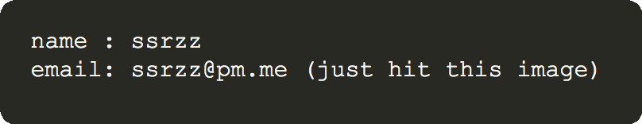

Leetcode 

========

### Leetcode Solutions 

Python solutions to Leetcode problems in Python3, inspired by [Haoel(CPP solutions)](https://github.com/haoel/leetcode). 
An incomplete unsorted list of **Ruby** solutions (with ids) to 600+ Leetcode problems can be found [here](./solutions/). 

(Note: the symbols 𝐇, 𝐌, 𝐄 after each ID imply the difficulties: Hard, Medium, Easy)

| #    | Title | Talk is cheap. Show me the code. | 
| ----: | -----: | -------: | 
|𝐄.21 | [merge-two-sorted-lists](https://leetcode.com/problems/merge-two-sorted-lists/description/) | [Python](./python_solutions/21.merge-two-sorted-lists.py)/[Ruby](./python_solutions/21.merge-two-sorted-lists.rb)| 
|𝐌.55 | [jump-game](https://leetcode.com/problems/jump-game/description/) | [Python](./python_solutions/55.jump-game.py)/[Ruby](./python_solutions/55.jump-game.rb)| 
|𝐌.73 | [set-matrix-zeroes](https://leetcode.com/problems/set-matrix-zeroes/description/) | [Python](./python_solutions/73.set-matrix-zeroes.py)/[Ruby](./python_solutions/73.set-matrix-zeroes.rb)| 
|𝐌.215 | [kth-largest-element-in-an-array](https://leetcode.com/problems/kth-largest-element-in-an-array/description/) | [Python](./python_solutions/215.kth-largest-element-in-an-array.py)/[Ruby](./python_solutions/215.kth-largest-element-in-an-array.rb)| 
|𝐄.225 | [implement-stack-using-queues](https://leetcode.com/problems/implement-stack-using-queues/description/) | [Python](./python_solutions/225.implement-stack-using-queues.py)/[Ruby](./python_solutions/225.implement-stack-using-queues.rb)| 
|𝐌.289 | [game-of-life](https://leetcode.com/problems/game-of-life/description/) | [Python](./python_solutions/289.game-of-life.py)/[Ruby](./python_solutions/289.game-of-life.rb)| 
|𝐄.342 | [power-of-four](https://leetcode.com/problems/power-of-four/description/) | [Python](./python_solutions/342.power-of-four.py)/[Ruby](./python_solutions/342.power-of-four.rb)| 
|𝐄.344 | [reverse-string](https://leetcode.com/problems/reverse-string/description/) | [Python](./python_solutions/344.reverse-string.py)/[Ruby](./python_solutions/344.reverse-string.rb)| 
|𝐄.345 | [reverse-vowels-of-a-string](https://leetcode.com/problems/reverse-vowels-of-a-string/description/) | [Python](./python_solutions/345.reverse-vowels-of-a-string.py)|
|𝐄.463 | [island-perimeter](https://leetcode.com/problems/island-perimeter/description/) | [Python](./python_solutions/463.island-perimeter.py)|
|𝐄.479 | [largest-palindrome-product](https://leetcode.com/problems/largest-palindrome-product/description/) | [Python](./python_solutions/479.largest-palindrome-product.py)|
|𝐌.525 | [contiguous-array](https://leetcode.com/problems/contiguous-array/description/) | [Python](./python_solutions/525.contiguous-array.py)|
|𝐄.541 | [reverse-string-ii](https://leetcode.com/problems/reverse-string-ii/description/) | [Python](./python_solutions/541.reverse-string-ii.py)|
|𝐌.583 | [delete-operation-for-two-strings](https://leetcode.com/problems/delete-operation-for-two-strings/description/) | [Python](./python_solutions/583.delete-operation-for-two-strings.py)|
|𝐌.659 | [split-array-into-consecutive-subsequences](https://leetcode.com/problems/split-array-into-consecutive-subsequences/description/) | [Python](./python_solutions/659.split-array-into-consecutive-subsequences.py)|
|𝐌.779 | [k-th-symbol-in-grammar](https://leetcode.com/problems/k-th-symbol-in-grammar/description/) | [Python](./python_solutions/779.k-th-symbol-in-grammar.py)|
|𝐇.891 | [sum-of-subsequence-widths](https://leetcode.com/problems/sum-of-subsequence-widths/description/) | [Python](./python_solutions/891.sum-of-subsequence-widths.py)|
|𝐄.914 | [x-of-a-kind-in-a-deck-of-cards](https://leetcode.com/problems/x-of-a-kind-in-a-deck-of-cards/description/) | [Python](./python_solutions/914.x-of-a-kind-in-a-deck-of-cards.py)/[Ruby](./python_solutions/914.x-of-a-kind-in-a-deck-of-cards.rb)| 
|𝐄.961 | [n-repeat-element](https://leetcode.com/problems/n-repeated-element-in-size-2n-array/description/) | [Python](./python_solutions/961.n-repeat-element.py)/[Ruby](./python_solutions/961.n-repeat-element.rb)| 
|𝐌.962 | [maximum-width-ramp](https://leetcode.com/problems/maximum-width-ramp/description/) | [Python](./python_solutions/962.maximum-width-ramp.py)/[Ruby](./python_solutions/962.maximum-width-ramp.rb)| 

### Contact

