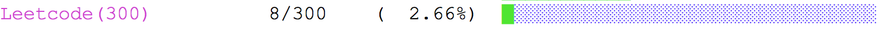

README
============================== 
* [Leetcode](www.leetcode.com) 题解代码，编程语言构成： Ruby (80%+) > C++ > Python. 

* Progress


------

### What those scripts are about?

* `build_solution.sh` | 
  * A bash script for downlonding problem descriptions and creating stratch solution (Python, Ruby, C++: depends on what you fancy) files
  * The only argument is the **problem id**. 
  *  E.g.,   ```bash build_solution.sh 123```  will build a (by default .rb) solution for problem 123. 

*****
### Log (100 Days Plan: 1 problem/per day solved with Python)

- `22/12/2018` :  [Easy] 463 island perimeter / [Medium] 779 k-th symbol in Grammar 
- `23/12/2018`： [Easy] 345, 541, 344 
- `progress` 
   


----

|Author|@ssrzz|
|:---  |:---
|E-mail|ssrzz@pm.me

### 


=begin
